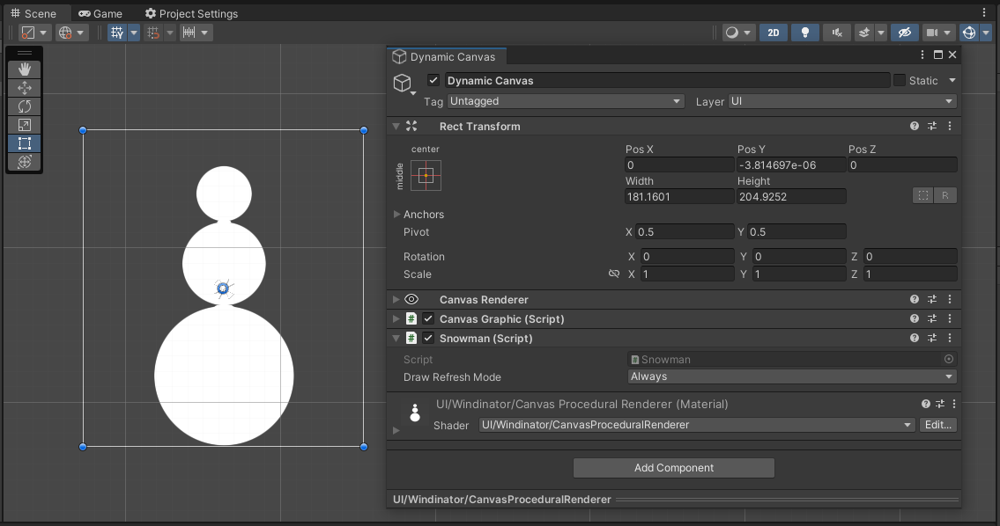
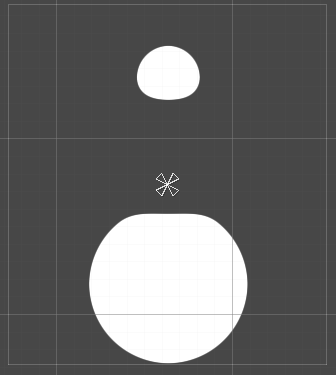

# Dynamic UI

Dynamic UI consists of procedurally generating, blending and unifying multiple shapes.
It works very close to how Unity's GUI system works.
To access the API you will need to use include **Riten**.**Windinator**.**Shapes** in your file.

Examples of application using WebGL:

- [Bouncy Menu](https://gameobject.xyz/demos/bouncy-sdf/)
- [Balls Benchmark](https://gameobject.xyz/demos/benchmark-1/)
- [Lines Benchmark](https://gameobject.xyz/demos/benchmark-2/)

## CanvasDrawer

To be able to draw your elements we created a MonoBehaviour wrapper called **CanvasDrawer**.
This class will give you a function protype that looks like this:

```c#
protected override void Draw(CanvasGraphic canvas, Vector2 size)
```

CanvasGraphic is where you will draw everything.
The *size* vector is the size of your RectTransform in pixels.

## Snowman Example

To get started add a Dynamic Canvas (this is just another graphic).


Now lets create a new script called *Snowman* and make it inherit **CanvasDrawer**.

```c#

using Riten.Windinator.Shapes;
using UnityEngine;

public class Snowman : CanvasDrawer
{
    protected override void Draw(CanvasGraphic canvas, Vector2 size)
    {
        // Get the max radius we can have without leaving the rect borders
        float radius = Mathf.Min(size.x, size.y) * 0.5f;

        float firstRadius = radius * 0.5f;
        float secondRadius = radius * 0.3f;
        float thirdRadius = radius * 0.2f;

        // Vector2.zero will draw at the center,
        // so to get the bottom position we need to substract the size
        Vector2 basePosition = new Vector2(0, -size.y * 0.5f + firstRadius);
        Vector2 bodyPosition = basePosition + Vector2.up * (firstRadius + secondRadius);
        Vector2 headPosition = bodyPosition + Vector2.up * (secondRadius + thirdRadius);

        // Draw our 3 circles to create the snowman
        canvas.CircleBrush.Draw(headPosition, thirdRadius);
        canvas.CircleBrush.Draw(bodyPosition, secondRadius);
        canvas.CircleBrush.Draw(basePosition, firstRadius);
    }
}
```

Now add this newly created component to your Dynamic Canvas and watch your snowman!



## Refresh Mode


You have three options to choose:

- **Always**, calls your Draw function every frame (on Update).
- **Once**, your draw function only gets called on Start and if your element changes size.
- **On Dirty**, same as *Once* but you can call `this.SetDirty();` to request a redraw.

## Blending

All of the available brushes have a blending parameter you can tweak.
Here is how the example above looks with 20 pixels of blending:

``` C#

canvas.CircleBrush.Draw(headPosition, thirdRadius, 20f);
canvas.CircleBrush.Draw(bodyPosition, secondRadius, 20f);
canvas.CircleBrush.Draw(basePosition, firstRadius, 20f);

```


## Draw Operations

By default the DrawOperation is always **Union**. This just adds the shapes together.
But you have other operations at your disposal like **Substract** & **Intersect**.

Here is how it looks if we substract the middle circle from the rest, because of the blending it chips away at the rest of the circles.

``` C#

// Order is significant with operations

canvas.CircleBrush.Draw(headPosition, thirdRadius, 20f);
canvas.CircleBrush.Draw(basePosition, firstRadius, 20f);
canvas.CircleBrush.Draw(bodyPosition, secondRadius, 20f, DrawOperation.Substract);

```



## Batching

The snowman example will use 3 drawcalls to draw all our snownman.
But we can optimize this to only 1!

``` C#

using Riten.Windinator.Shapes;
using UnityEngine;

public class Snowman : CanvasDrawer
{
    [SerializeField] float m_blend = 0f;

    protected override void Draw(CanvasGraphic canvas, Vector2 size)
    {
        float radius = Mathf.Min(size.x, size.y) * 0.5f;

        float firstRadius = radius * 0.5f;
        float secondRadius = radius * 0.3f;
        float thirdRadius = radius * 0.2f;

        Vector2 basePosition = new Vector2(0, -size.y * 0.5f + firstRadius);
        Vector2 bodyPosition = basePosition + Vector2.up * (firstRadius + secondRadius);
        Vector2 headPosition = bodyPosition + Vector2.up * (secondRadius + thirdRadius);

        canvas.CircleBrush.AddBatch(headPosition, thirdRadius, m_blend);
        canvas.CircleBrush.AddBatch(basePosition, firstRadius, m_blend);
        canvas.CircleBrush.AddBatch(bodyPosition, secondRadius, m_blend);

        // The circles only get drawn here!
        // This will also clear the inner batch content
        canvas.CircleBrush.DrawBatch(DrawOperation.Union);
    }
}

```

## Brushes

As of the writing of this documentation there are 3 brushes: **LineBrush**, **CircleBrush** and **RectBrush**.
More will be added in the future, namely PolygonBrush and BezierBrush are being worked on.

They all allow for direct Drawing and batched Drawing.

## Styling

The final result can be tweaked like any [SDF Graphics](extra-ui.md) element. 


## Optimizing

A quick optimization tip is to play with the quality slider, this will increase FPS exponentially!

You can see that even at 2% quality, the Snowman is still visible.


