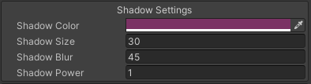
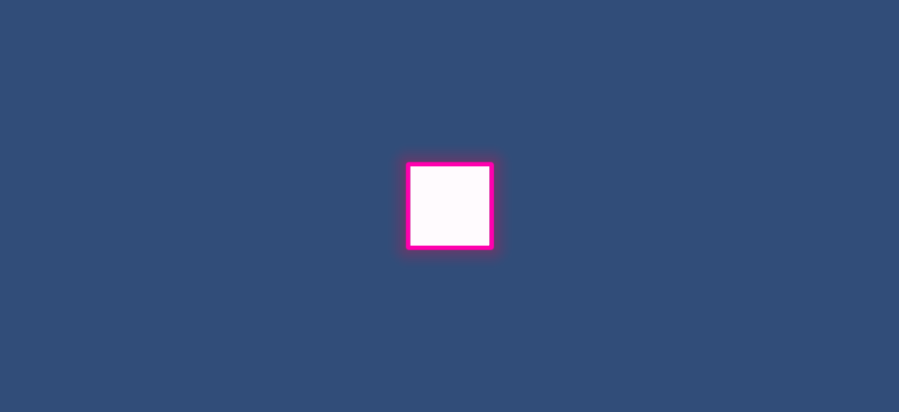
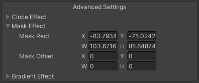
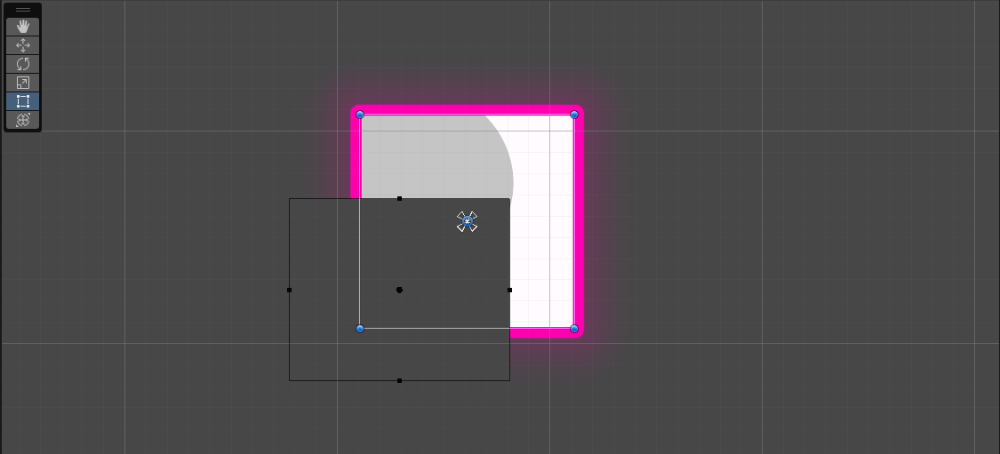
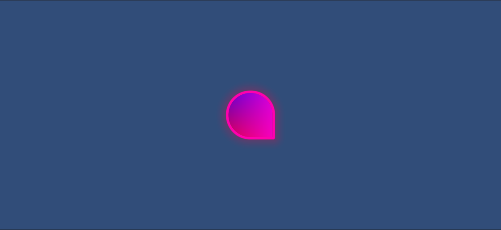
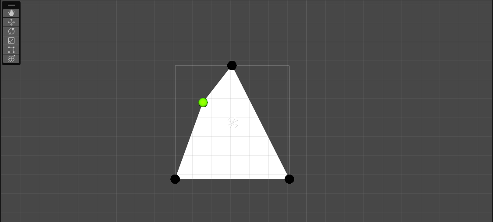

# UI Graphics

This sections goes over additional components that expand your toolset and will help you create better user interfaces without the need of additional images and graphics.

## Rectangle Graphic

The Rectangle Graphic is a new UI component that renders a simple rectangle that can be costumized in different ways.
It uses signed distance fields to render which results in perfect anti-aliased images.
To create this element, right click on the hierarchy and select *UI->More Shapes->Rectangle*.

By default it looks like a normal white rectangle but you have a couple more settings to play around with.

### Outline Settings

An outline is just a set of pixels that expands from the graphic.
They can be any color and any distance from the border.

- **Outline Size** is the number of pixels that the outline will take up on the screen.

### Shadow Settings

Configure how the shadow of this graphic should look.
The shadow is always behind the graphic and outline.

- **Shadow Size** is the number of pixels that the shadow will take up on the screen.
- **Shadow Blur** changes how blury the shadow is, 0 means no blur (essentially the same as an outline).
- **Shadow Power** this allows you to change the shadow's blur exponentially.

### Circle Overlay

Circle overlay adds a simple circle that doesn't get out of the graphic's area.
This circle was used to create the Material design effect when pressing buttons or cards.
In the scene view when the option is expanded you can edit the circle's position and radius using a custom set of controls.

- **Circle Radius** is the number of pixels the circle's radius will take.
- **Alpha Multiplier** is simply multiplied with the color's alpha value.
- **Circle Pos** defines where the circle's center is.

### Masking

Masking allows to cut the image either from the borders or from a rect's position.
This is useful if you want to break apart a graphic to make place for text or other artistic intentions.

In the scene view when the option is expanded you can edit the mask's rect position and size using a custom set of controls.

### Gradient

The gradient can only be set using 4 colors each representing a corner of the graphic.
By default they will be white.

### Roundness

Roundness is also in pixels and defines the curviness of corners.

- **Max Roundess** Make the roundness the maximum possible value.
- **Uniform Roundness** If ticked, you will only have one value for roundness and the same value will be applied for all corners.
- **Roudness** defines the roundess for all or every individual corner in pixels.

## Polygon Graphic

Polygon graphics are essentially the same as the Rectangle graphic except you can add up to 1023 different points to create more complex shapes. This can be easily animated via a custom script to create interesting effects.

And here is the same polygon with some styling.

