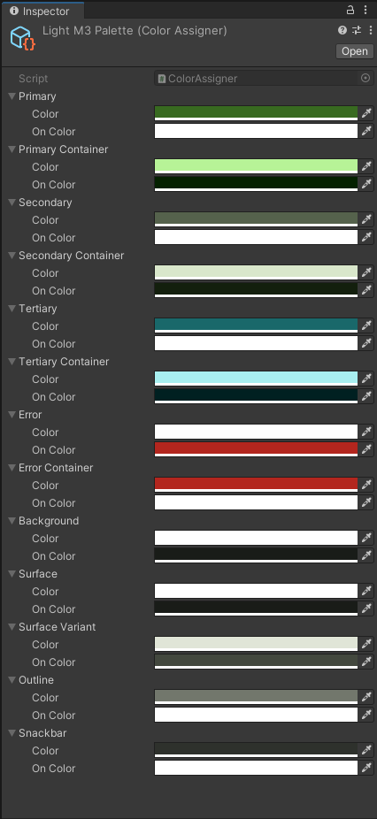
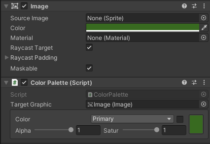
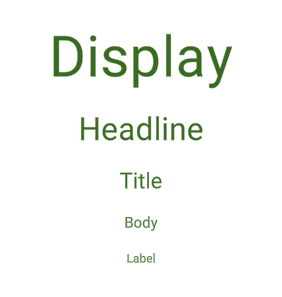
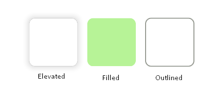
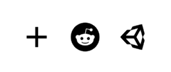
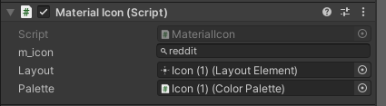
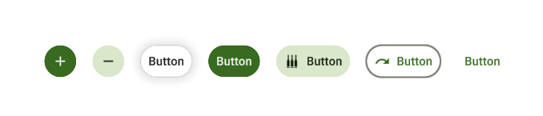
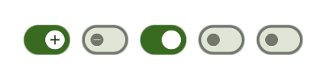
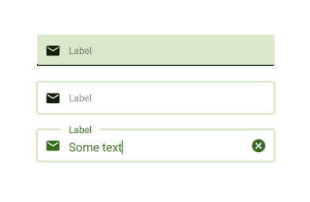
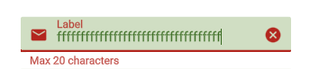

# Material UI

To create a new Material element, go under *UI->Material->(Pick What You Want)*.

## Palettes

Color palettes allow you to easily switch between different styles but also keep a consistent look across all your UI.
Out of the box, Windinator comes with 3 styles:

- Baseline
- Floral
- Material3

All of the styles above have their light and dark counter-parts.

You can then attach the "Color Palette" script to any graphical component and select the color you want to assign.
If you tick the box next to the color name, you will be able to put a custom color although this isn't advised.

## Labels

Labels are simple TextMeshPro components with a custom font and predefined set of styles (font sizes).

## Cards

Cards are simple rectangles with rounded corders and some pre-set styles that you can switch between.
This just followes Material design guidelines and helps you create consitent looks.

## Icons

Windinator comes with all the Material Design icons built-in.
You can simply start typing the icon's name and it will show you all available options.

## Buttons

Buttons have a circle effect when pressed and have some built-in styles:

- Elevated
- Filled
- Tonal
- Outlined
- Text
- Manual (This just stops controling any colors and leaves it up to you)

Buttons can also have an optional icon prepended to the text.

All of these styles can also be used with Action buttons which are completly rounded and only composed of an icon.

## Radio, Switches & Checkboxes

All of these are controls for selection options.
They are all animated and adapt to selected style.

## Input Fields

Input fields have two different styles (filled & outlined) and they can contain an optional icon, label and helper text.

They can also be configured to validate a Regex string with an error message for forms.

