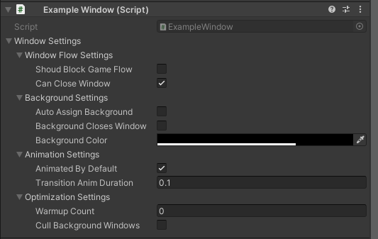
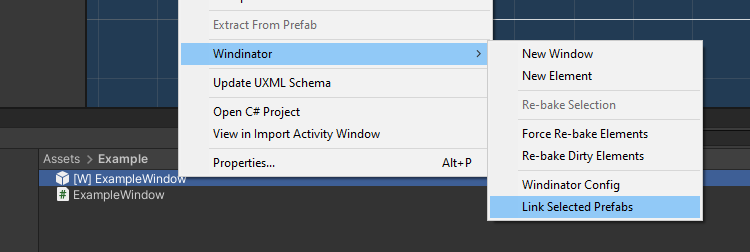

# Windows

## Creating a Window


Once you create a new window, it will generate two files.
One prefab which is going to be your UI content.
And a controller which is a script with the same name, if no errors happened during creation the controller will automatically be attached to the prefab.


To edit the window's content double click the prefab (\[W\] ExampleWindow) file and start populating your canvas.

If you want to show your window during runtime you just have to push it:

``` C#
Windinator.Push<ExampleWindow>();
```

## Window Settings



- **Should Block Game Flow**: This lets the system know that you want your game to enter a pause state or impede player controls when this window is open.

- **Can Close Window**: If this is enabled your window might be closed by external actions, for example pressing escape or the back button on a mobile phone. Otherwise you are in full control for when it should close (Can only be closed with *ForcePopWindow()* function).

- **Auto Assign Background**: If you are creating a pop-up, this will add a transparent background behind your window automatically.

- **Background Closes Window**: If background is assigned, once the user clicks it during runtime it will Pop the current window.

- **Background Color**: Customize the background color, the default value of this can be customized via the Windinator Config file.

- **Animated By Default**: If true, apply simple fade in/out effect.

- **Transition Anim Duration**: Duration of animations.

- **Warmup Count**: Windows are recycled to avoid instantiating a new one every single time. This setting will create some copies at startup to avoid freezing during user interaction.

- **Cull Background Windows**: If true, any window behind this one will be culled (not rendered). This helps performance.

## Fixing Linking Issues

If you get a missing reference error from Windinator you might have to re-link the window:


